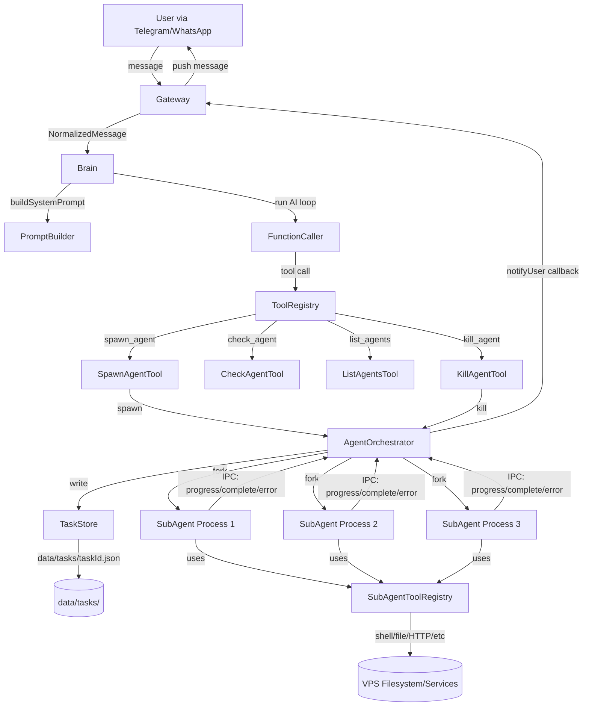

# SuperClaw — Real Sub-Agent System Architecture Specification

**Version:** 1.0  
**Status:** Ready for Implementation  
**Target Mode:** Code  
**Author:** Architect Mode  
**Date:** 2026-02-28

---

## Table of Contents

1. [Executive Summary](#1-executive-summary)
2. [Sub-Agent Process Model](#2-sub-agent-process-model)
3. [IPC Communication Protocol](#3-ipc-communication-protocol)
4. [Task State Machine](#4-task-state-machine)
5. [TypeScript Interfaces](#5-typescript-interfaces)
6. [New Files to Create](#6-new-files-to-create)
7. [Existing Files to Modify](#7-existing-files-to-modify)
8. [Master Brain Changes](#8-master-brain-changes)
9. [Sub-Agent Capabilities](#9-sub-agent-capabilities)
10. [Security and Resource Limits](#10-security-and-resource-limits)
11. [Example Flow: Build a Website](#11-example-flow-build-a-website)
12. [File Change Summary](#12-file-change-summary)
13. [Mermaid Architecture Diagram](#13-mermaid-architecture-diagram)

---

## 1. Executive Summary

SuperClaw currently processes all tasks sequentially in a single Node.js process. This spec introduces a **real sub-agent system** where the master agent can spawn independent Node.js child processes, each running a full AI function-calling loop with its own model/provider, working on subtasks in parallel.

### Key Design Decisions

| Decision | Choice | Rationale |
|----------|--------|-----------|
| Spawn mechanism | `child_process.fork()` | Native IPC channel, no extra deps, clean process isolation |
| Communication | IPC messages + `data/tasks/<taskId>.json` files | IPC for live events, JSON files for durable state |
| Task storage | `data/tasks/<taskId>.json` | Simple, inspectable, survives crashes, no extra DB tables |
| Max concurrency | 5 sub-agents | Prevents RAM exhaustion on typical VPS (2–4 GB) |
| Timeout | 10 minutes per sub-agent | Prevents zombie processes |
| Sub-agent tools | Full tool set (same as master) | Sub-agents need shell/file/HTTP to do real work |
| Progress reporting | Event-driven via IPC → Telegram push | User gets live updates without polling |
| Model per sub-agent | Configurable per spawn call | Master can assign cheap/fast models to simple subtasks |

---

## 2. Sub-Agent Process Model

### 2.1 Why `child_process.fork()` over alternatives

| Option | Pros | Cons | Decision |
|--------|------|------|----------|
| `child_process.fork()` | Built-in IPC channel, separate memory space, clean kill, TypeScript-friendly | Slightly more RAM per process | **CHOSEN** |
| `worker_threads` | Shared memory possible, lighter | Shared memory = shared bugs, harder to kill cleanly | Rejected |
| PM2 child processes | PM2 manages lifecycle | Requires PM2 API, complex, overkill | Rejected |
| `child_process.spawn()` | Flexible | No built-in IPC, must use stdin/stdout | Rejected |

### 2.2 Process Lifecycle

```
Master Process (PM2-managed)
  └── AgentOrchestrator
        ├── fork() → SubAgent Process #1  (taskId: abc123)
        ├── fork() → SubAgent Process #2  (taskId: def456)
        └── fork() → SubAgent Process #3  (taskId: ghi789)
```

Each sub-agent process:
1. Is forked from `src/agents/SubAgent.ts` (compiled to `dist/agents/SubAgent.js`)
2. Receives its task config via IPC `init` message immediately after fork
3. Runs its own `FunctionCaller` loop with its assigned model/provider
4. Writes progress to `data/tasks/<taskId>.json`
5. Sends IPC messages back to master for live events
6. Exits with code `0` (success) or `1` (failure) when done

### 2.3 Memory Budget

| Component | RAM estimate |
|-----------|-------------|
| Master process | ~150–200 MB |
| Each sub-agent process | ~80–120 MB |
| 5 sub-agents max | ~400–600 MB additional |
| **Total worst case** | **~800 MB** |

This fits comfortably on a 2 GB VPS. The `maxConcurrentAgents` limit (default: 5) enforces this ceiling.

### 2.4 Sub-Agent Entry Point

The sub-agent entry point is `src/agents/SubAgent.ts`. It is compiled to `dist/agents/SubAgent.js` and forked with:

```typescript
const child = fork(path.resolve(__dirname, '../agents/SubAgent.js'), [], {
  env: { ...process.env },   // inherit all env vars (API keys, etc.)
  stdio: ['ignore', 'pipe', 'pipe', 'ipc'],  // capture stdout/stderr, keep IPC
});
```

The `stdio: 'ipc'` at index 3 enables the built-in IPC channel (`process.send()` / `child.on('message')`).

---

## 3. IPC Communication Protocol

All IPC messages are typed JSON objects sent via `process.send()` (child → master) and `child.send()` (master → child).

### 3.1 Master → Child Messages

```typescript
// Sent immediately after fork to initialize the sub-agent
interface SubAgentInitMessage {
  type: 'init';
  task: SubAgentTask;  // full task definition (see §5)
}

// Sent to request graceful shutdown
interface SubAgentKillMessage {
  type: 'kill';
  reason: string;
}
```

### 3.2 Child → Master Messages

```typescript
// Sub-agent is ready and starting work
interface SubAgentReadyMessage {
  type: 'ready';
  taskId: string;
  pid: number;
}

// Progress update (sent after each tool call or AI iteration)
interface SubAgentProgressMessage {
  type: 'progress';
  taskId: string;
  message: string;       // human-readable progress text
  toolsUsed: string[];   // tools used so far
  iteration: number;     // current AI loop iteration
}

// Tool execution event (for master to log/display)
interface SubAgentToolMessage {
  type: 'tool_call';
  taskId: string;
  toolName: string;
  params: Record<string, unknown>;
  result: unknown;
}

// Task completed successfully
interface SubAgentCompleteMessage {
  type: 'complete';
  taskId: string;
  result: string;        // final AI response / summary
  toolsUsed: string[];
  durationMs: number;
}

// Task failed
interface SubAgentErrorMessage {
  type: 'error';
  taskId: string;
  error: string;
  durationMs: number;
}
```

### 3.3 IPC Message Union Type

```typescript
type SubAgentIPCMessage =
  | SubAgentReadyMessage
  | SubAgentProgressMessage
  | SubAgentToolMessage
  | SubAgentCompleteMessage
  | SubAgentErrorMessage;

type MasterIPCMessage =
  | SubAgentInitMessage
  | SubAgentKillMessage;
```

---

## 4. Task State Machine

### 4.1 States

```
pending → running → completed
                 → failed
                 → killed
```

| State | Description | Terminal? |
|-------|-------------|-----------|
| `pending` | Task created, not yet started | No |
| `running` | Sub-agent process is active | No |
| `completed` | Sub-agent finished successfully | Yes |
| `failed` | Sub-agent threw an error or timed out | Yes |
| `killed` | Master killed the sub-agent via KillAgentTool | Yes |

### 4.2 Task File Storage

Each task is stored as a JSON file at `data/tasks/<taskId>.json`.

- Directory: `data/tasks/` (created on first use)
- File name: `<taskId>.json` where `taskId` is a UUID v4
- Written by: `TaskStore.ts`
- Read by: `CheckAgentTool`, `ListAgentsTool`, `AgentOrchestrator`

### 4.3 Task JSON Schema

```json
{
  "id": "a1b2c3d4-e5f6-7890-abcd-ef1234567890",
  "parentTaskId": null,
  "label": "Build HTML for sub.pmdice.com",
  "model": "gpt-4o-mini",
  "provider": "openai",
  "prompt": "Create a complete index.html for sub.pmdice.com with...",
  "status": "running",
  "result": null,
  "toolsUsed": ["shell_execute", "file_write"],
  "iteration": 3,
  "pid": 12345,
  "startedAt": "2026-02-28T05:00:00.000Z",
  "completedAt": null,
  "error": null,
  "timeoutMs": 600000,
  "createdAt": "2026-02-28T04:59:58.000Z"
}
```

---

## 5. TypeScript Interfaces

All interfaces live in `src/agents/types.ts`.

```typescript
// src/agents/types.ts

export type TaskStatus = 'pending' | 'running' | 'completed' | 'failed' | 'killed';

export type AIProvider = 'openai' | 'anthropic' | 'groq' | 'ollama' | 'custom';

export interface SubAgentTask {
  id: string;                    // UUID v4
  parentTaskId: string | null;   // null for top-level tasks
  label: string;                 // short human-readable label
  model: string;                 // e.g. "gpt-4o-mini", "claude-3-haiku-20240307"
  provider: AIProvider;          // which AI provider to use
  prompt: string;                // the full task prompt for the sub-agent
  status: TaskStatus;
  result: string | null;         // final response when completed
  toolsUsed: string[];           // accumulated list of tools used
  iteration: number;             // current AI loop iteration
  pid: number | null;            // OS process ID when running
  startedAt: string | null;      // ISO timestamp
  completedAt: string | null;    // ISO timestamp
  error: string | null;          // error message if failed/killed
  timeoutMs: number;             // default: 600000 (10 min)
  createdAt: string;             // ISO timestamp
}

export interface SpawnAgentParams {
  label: string;
  prompt: string;
  model?: string;                // defaults to master's model
  provider?: AIProvider;         // defaults to master's provider
  timeoutMs?: number;            // defaults to 600000
}

export interface AgentHandle {
  task: SubAgentTask;
  process: import('child_process').ChildProcess;
  timeoutTimer: NodeJS.Timeout;
}

// IPC message types
export interface SubAgentInitMessage {
  type: 'init';
  task: SubAgentTask;
}

export interface SubAgentKillMessage {
  type: 'kill';
  reason: string;
}

export interface SubAgentReadyMessage {
  type: 'ready';
  taskId: string;
  pid: number;
}

export interface SubAgentProgressMessage {
  type: 'progress';
  taskId: string;
  message: string;
  toolsUsed: string[];
  iteration: number;
}

export interface SubAgentToolMessage {
  type: 'tool_call';
  taskId: string;
  toolName: string;
  params: Record<string, unknown>;
  result: unknown;
}

export interface SubAgentCompleteMessage {
  type: 'complete';
  taskId: string;
  result: string;
  toolsUsed: string[];
  durationMs: number;
}

export interface SubAgentErrorMessage {
  type: 'error';
  taskId: string;
  error: string;
  durationMs: number;
}

export type SubAgentIPCMessage =
  | SubAgentReadyMessage
  | SubAgentProgressMessage
  | SubAgentToolMessage
  | SubAgentCompleteMessage
  | SubAgentErrorMessage;

export type MasterIPCMessage =
  | SubAgentInitMessage
  | SubAgentKillMessage;
```

---

## 6. New Files to Create

### 6.1 `src/agents/types.ts`
**Purpose:** All TypeScript interfaces for the sub-agent system (see §5 above).

---

### 6.2 `src/agents/TaskStore.ts`
**Purpose:** Reads and writes task state to `data/tasks/<taskId>.json`. Singleton. Thread-safe via synchronous `fs` operations (acceptable since tasks are written infrequently).

```typescript
// src/agents/TaskStore.ts
import fs from 'fs';
import path from 'path';
import { v4 as uuidv4 } from 'uuid';
import { SubAgentTask, TaskStatus, SpawnAgentParams } from './types';
import { config } from '../config';
import { logger } from '../logger';

const TASKS_DIR = path.resolve(process.cwd(), 'data/tasks');

export class TaskStore {
  constructor() {
    if (!fs.existsSync(TASKS_DIR)) {
      fs.mkdirSync(TASKS_DIR, { recursive: true });
    }
  }

  createTask(params: SpawnAgentParams): SubAgentTask {
    const task: SubAgentTask = {
      id: uuidv4(),
      parentTaskId: null,
      label: params.label,
      model: params.model ?? config.aiModel,
      provider: params.provider ?? config.aiProvider,
      prompt: params.prompt,
      status: 'pending',
      result: null,
      toolsUsed: [],
      iteration: 0,
      pid: null,
      startedAt: null,
      completedAt: null,
      error: null,
      timeoutMs: params.timeoutMs ?? 600000,
      createdAt: new Date().toISOString(),
    };
    this.write(task);
    return task;
  }

  read(taskId: string): SubAgentTask | null {
    const filePath = this.taskPath(taskId);
    if (!fs.existsSync(filePath)) return null;
    try {
      return JSON.parse(fs.readFileSync(filePath, 'utf-8')) as SubAgentTask;
    } catch (e) {
      logger.error(`TaskStore: failed to read ${taskId}`, { e });
      return null;
    }
  }

  write(task: SubAgentTask): void {
    fs.writeFileSync(this.taskPath(task.id), JSON.stringify(task, null, 2), 'utf-8');
  }

  update(taskId: string, patch: Partial<SubAgentTask>): SubAgentTask | null {
    const task = this.read(taskId);
    if (!task) return null;
    const updated = { ...task, ...patch };
    this.write(updated);
    return updated;
  }

  listAll(): SubAgentTask[] {
    if (!fs.existsSync(TASKS_DIR)) return [];
    return fs.readdirSync(TASKS_DIR)
      .filter(f => f.endsWith('.json'))
      .map(f => {
        try {
          return JSON.parse(fs.readFileSync(path.join(TASKS_DIR, f), 'utf-8')) as SubAgentTask;
        } catch { return null; }
      })
      .filter((t): t is SubAgentTask => t !== null)
      .sort((a, b) => new Date(b.createdAt).getTime() - new Date(a.createdAt).getTime());
  }

  listByStatus(status: TaskStatus): SubAgentTask[] {
    return this.listAll().filter(t => t.status === status);
  }

  private taskPath(taskId: string): string {
    return path.join(TASKS_DIR, `${taskId}.json`);
  }
}

export const taskStore = new TaskStore();
export default taskStore;
```

---

### 6.3 `src/agents/AgentOrchestrator.ts`
**Purpose:** Spawns sub-agent processes, tracks them in memory, handles IPC events, enforces limits, and pushes progress to the user via the Gateway.

```typescript
// src/agents/AgentOrchestrator.ts
import { fork, ChildProcess } from 'child_process';
import path from 'path';
import { EventEmitter } from 'events';
import { SubAgentTask, AgentHandle, SpawnAgentParams, SubAgentIPCMessage, MasterIPCMessage } from './types';
import { taskStore } from './TaskStore';
import { gateway } from '../gateway/Gateway';
import { logger } from '../logger';

const MAX_CONCURRENT_AGENTS = 5;
const SUB_AGENT_ENTRY = path.resolve(__dirname, 'SubAgent.js');

export class AgentOrchestrator extends EventEmitter {
  // In-memory map of running agents: taskId → AgentHandle
  private handles: Map<string, AgentHandle> = new Map();

  // Callback for pushing messages to user (set by Brain)
  private notifyUser: ((text: string) => void) | null = null;

  setNotifyCallback(fn: (text: string) => void): void {
    this.notifyUser = fn;
  }

  getRunningCount(): number {
    return this.handles.size;
  }

  async spawn(params: SpawnAgentParams): Promise<SubAgentTask> {
    if (this.handles.size >= MAX_CONCURRENT_AGENTS) {
      throw new Error(
        `Max concurrent sub-agents (${MAX_CONCURRENT_AGENTS}) reached. ` +
        `Kill an existing agent or wait for one to complete.`
      );
    }

    // Create task record
    const task = taskStore.createTask(params);
    logger.info(`AgentOrchestrator: spawning sub-agent ${task.id} (${task.label})`);

    // Fork the sub-agent process
    const child = fork(SUB_AGENT_ENTRY, [], {
      env: { ...process.env },
      stdio: ['ignore', 'pipe', 'pipe', 'ipc'],
    });

    // Pipe sub-agent stdout/stderr to our logger
    child.stdout?.on('data', (d: Buffer) => {
      logger.debug(`[SubAgent:${task.id.slice(0, 8)}] ${d.toString().trim()}`);
    });
    child.stderr?.on('data', (d: Buffer) => {
      logger.warn(`[SubAgent:${task.id.slice(0, 8)}] STDERR: ${d.toString().trim()}`);
    });

    // Set up timeout
    const timeoutTimer = setTimeout(() => {
      this.killAgent(task.id, 'Timeout exceeded');
    }, task.timeoutMs);

    const handle: AgentHandle = { task, process: child, timeoutTimer };
    this.handles.set(task.id, handle);

    // Handle IPC messages from child
    child.on('message', (msg: SubAgentIPCMessage) => {
      this.handleChildMessage(task.id, msg);
    });

    // Handle process exit
    child.on('exit', (code, signal) => {
      clearTimeout(timeoutTimer);
      this.handles.delete(task.id);
      const current = taskStore.read(task.id);
      if (current && current.status === 'running') {
        // Process exited without sending complete/error — treat as failure
        taskStore.update(task.id, {
          status: 'failed',
          error: `Process exited unexpectedly (code=${code}, signal=${signal})`,
          completedAt: new Date().toISOString(),
        });
        this.notify(`❌ Sub-agent *${task.label}* exited unexpectedly (code=${code})`);
      }
      logger.info(`AgentOrchestrator: sub-agent ${task.id} exited (code=${code})`);
    });

    // Send init message to child
    const initMsg: MasterIPCMessage = { type: 'init', task };
    child.send(initMsg);

    // Update task to running
    taskStore.update(task.id, { status: 'running', startedAt: new Date().toISOString() });

    return task;
  }

  killAgent(taskId: string, reason: string = 'Killed by master'): boolean {
    const handle = this.handles.get(taskId);
    if (!handle) return false;

    clearTimeout(handle.timeoutTimer);
    handle.process.kill('SIGTERM');
    this.handles.delete(taskId);

    taskStore.update(taskId, {
      status: 'killed',
      error: reason,
      completedAt: new Date().toISOString(),
    });

    this.notify(`🛑 Sub-agent *${handle.task.label}* killed: ${reason}`);
    logger.info(`AgentOrchestrator: killed sub-agent ${taskId} — ${reason}`);
    return true;
  }

  private handleChildMessage(taskId: string, msg: SubAgentIPCMessage): void {
    logger.debug(`AgentOrchestrator: IPC from ${taskId}: ${msg.type}`);

    switch (msg.type) {
      case 'ready':
        taskStore.update(taskId, { pid: msg.pid });
        break;

      case 'progress':
        taskStore.update(taskId, {
          toolsUsed: msg.toolsUsed,
          iteration: msg.iteration,
        });
        this.notify(`⚙️ *${taskStore.read(taskId)?.label}* — ${msg.message}`);
        break;

      case 'tool_call':
        logger.info(`[SubAgent:${taskId.slice(0, 8)}] tool: ${msg.toolName}`);
        break;

      case 'complete': {
        const handle = this.handles.get(taskId);
        if (handle) clearTimeout(handle.timeoutTimer);
        this.handles.delete(taskId);

        taskStore.update(taskId, {
          status: 'completed',
          result: msg.result,
          toolsUsed: msg.toolsUsed,
          completedAt: new Date().toISOString(),
        });

        const task = taskStore.read(taskId);
        this.notify(
          `✅ Sub-agent *${task?.label}* completed in ${Math.round(msg.durationMs / 1000)}s\n\n${msg.result}`
        );
        this.emit('complete', taskId, msg.result);
        break;
      }

      case 'error': {
        const handle = this.handles.get(taskId);
        if (handle) clearTimeout(handle.timeoutTimer);
        this.handles.delete(taskId);

        taskStore.update(taskId, {
          status: 'failed',
          error: msg.error,
          completedAt: new Date().toISOString(),
        });

        const task = taskStore.read(taskId);
        this.notify(`❌ Sub-agent *${task?.label}* failed: ${msg.error}`);
        this.emit('error', taskId, msg.error);
        break;
      }
    }
  }

  private notify(text: string): void {
    if (this.notifyUser) {
      this.notifyUser(text);
    }
  }
}

export const agentOrchestrator = new AgentOrchestrator();
export default agentOrchestrator;
```

---

### 6.4 `src/agents/SubAgent.ts`
**Purpose:** The worker entry point. Runs as a forked child process. Receives a task via IPC, runs a full AI function-calling loop, and reports back.

```typescript
// src/agents/SubAgent.ts
// This file runs as a CHILD PROCESS via child_process.fork()
// It must NOT import anything that requires the master's singleton state
// (no gateway, no conversationDB, no brain)

import OpenAI from 'openai';
import { SubAgentTask, SubAgentIPCMessage, MasterIPCMessage } from './types';
import { toolRegistry } from '../brain/ToolRegistry';
import { logger } from '../logger';

const MAX_ITERATIONS = 15;

// ── Wait for init message from master ──────────────────────────────────────
process.on('message', async (msg: MasterIPCMessage) => {
  if (msg.type === 'init') {
    await runSubAgent(msg.task);
  } else if (msg.type === 'kill') {
    logger.info(`SubAgent: received kill signal — ${msg.reason}`);
    process.exit(0);
  }
});

function send(msg: SubAgentIPCMessage): void {
  if (process.send) process.send(msg);
}

async function runSubAgent(task: SubAgentTask): Promise<void> {
  const startedAt = Date.now();

  send({ type: 'ready', taskId: task.id, pid: process.pid });

  try {
    const result = await runAILoop(task);
    const durationMs = Date.now() - startedAt;
    send({ type: 'complete', taskId: task.id, result, toolsUsed: [], durationMs });
    process.exit(0);
  } catch (err: any) {
    const durationMs = Date.now() - startedAt;
    send({ type: 'error', taskId: task.id, error: err.message, durationMs });
    process.exit(1);
  }
}

async function runAILoop(task: SubAgentTask): Promise<string> {
  // Build OpenAI-compatible client based on task.provider
  const client = buildClient(task);
  const tools = toolRegistry.toOpenAiFunctions();
  const toolsUsed: string[] = [];

  const systemPrompt = buildSubAgentSystemPrompt(task);

  const messages: OpenAI.Chat.ChatCompletionMessageParam[] = [
    { role: 'system', content: systemPrompt },
    { role: 'user', content: task.prompt },
  ];

  for (let i = 0; i < MAX_ITERATIONS; i++) {
    send({
      type: 'progress',
      taskId: task.id,
      message: `AI iteration ${i + 1}/${MAX_ITERATIONS}`,
      toolsUsed,
      iteration: i + 1,
    });

    const response = await client.chat.completions.create({
      model: task.model,
      messages,
      tools,
      tool_choice: 'auto',
      max_tokens: 4096,
    });

    const choice = response.choices[0];
    if (!choice) break;

    const assistantMessage = choice.message;
    messages.push(assistantMessage as OpenAI.Chat.ChatCompletionMessageParam);

    if (!assistantMessage.tool_calls || assistantMessage.tool_calls.length === 0) {
      return assistantMessage.content || 'Task completed.';
    }

    for (const toolCall of assistantMessage.tool_calls) {
      const toolName = toolCall.function.name;
      const toolParams = JSON.parse(toolCall.function.arguments || '{}');

      toolsUsed.push(toolName);

      const tool = toolRegistry.getTool(toolName);
      let toolResult: unknown;

      if (!tool) {
        toolResult = { success: false, error: `Tool not found: ${toolName}` };
      } else {
        toolResult = await tool.execute(toolParams);
      }

      send({
        type: 'tool_call',
        taskId: task.id,
        toolName,
        params: toolParams,
        result: toolResult,
      });

      messages.push({
        role: 'tool',
        tool_call_id: toolCall.id,
        content: JSON.stringify(toolResult),
      });
    }
  }

  return 'Maximum iterations reached. Task may be incomplete.';
}

function buildClient(task: SubAgentTask): OpenAI {
  switch (task.provider) {
    case 'groq':
      return new OpenAI({
        apiKey: process.env.GROQ_API_KEY || '',
        baseURL: 'https://api.groq.com/openai/v1',
      });
    case 'custom':
      return new OpenAI({
        apiKey: process.env.CUSTOM_AI_API_KEY || 'none',
        baseURL: process.env.CUSTOM_AI_BASE_URL || '',
      });
    case 'openai':
    default:
      return new OpenAI({ apiKey: process.env.OPENAI_API_KEY || '' });
  }
}

function buildSubAgentSystemPrompt(task: SubAgentTask): string {
  const toolList = toolRegistry.toDescriptionList();
  return `You are a specialized sub-agent of SuperClaw, an autonomous AI agent running on a Linux Ubuntu VPS.
You have been assigned a specific task by the master agent.

## Your Task
${task.label}

## Available Tools
${toolList}

## Rules
1. Focus ONLY on your assigned task. Do not go beyond its scope.
2. Use tools to accomplish the task fully and autonomously.
3. When done, provide a clear summary of what you accomplished.
4. If you cannot complete the task, explain why clearly.
5. Do not ask for confirmation — execute the task directly.
6. Write results to files when appropriate (use file_write tool).
7. Be concise in your final response — summarize what was done.`;
}
```

**Important notes for implementation:**
- `SubAgent.ts` must NOT import `gateway`, `conversationDB`, `brain`, or any singleton that requires the master's state
- It MUST import `toolRegistry` — this is safe because `ToolRegistry` is stateless (just a map of tool definitions)
- The `ShellTool` in sub-agents will NOT have `platform`/`chatId`/`userId` context, so destructive command confirmation will be skipped — this is intentional (sub-agents are trusted workers)
- For `anthropic` provider, implement a ReAct-style text loop similar to `FunctionCaller.runAnthropicLoop()`
- For `ollama` provider, implement a simple prompt loop similar to `FunctionCaller.runOllamaLoop()`

---

### 6.5 `src/tools/SpawnAgentTool.ts`
**Purpose:** Tool the master brain uses to create a new sub-agent. Returns the task ID immediately (non-blocking).

```typescript
// src/tools/SpawnAgentTool.ts
import { Tool, ToolResult } from '../gateway/types';
import { agentOrchestrator } from '../agents/AgentOrchestrator';
import { AIProvider } from '../agents/types';
import { logger } from '../logger';

export class SpawnAgentTool implements Tool {
  name = 'spawn_agent';
  description =
    'Spawns a new sub-agent process to work on a task in parallel. ' +
    'Returns immediately with a taskId. Use check_agent to poll status. ' +
    'Sub-agents can use all tools (shell, file, HTTP, etc.) and run their own AI loop. ' +
    'You can assign a different AI model/provider to each sub-agent.';

  parameters = {
    type: 'object',
    properties: {
      label: {
        type: 'string',
        description: 'Short human-readable label for this task (e.g. "Build HTML for sub.pmdice.com")',
      },
      prompt: {
        type: 'string',
        description: 'Full task description for the sub-agent. Be specific and detailed.',
      },
      model: {
        type: 'string',
        description: 'AI model to use (e.g. "gpt-4o-mini", "claude-3-haiku-20240307"). Defaults to master model.',
      },
      provider: {
        type: 'string',
        enum: ['openai', 'anthropic', 'groq', 'ollama', 'custom'],
        description: 'AI provider for this sub-agent. Defaults to master provider.',
      },
      timeoutMs: {
        type: 'number',
        description: 'Timeout in milliseconds (default: 600000 = 10 minutes)',
      },
    },
    required: ['label', 'prompt'],
  };

  async execute(params: {
    label: string;
    prompt: string;
    model?: string;
    provider?: AIProvider;
    timeoutMs?: number;
  }): Promise<ToolResult> {
    try {
      const task = await agentOrchestrator.spawn({
        label: params.label,
        prompt: params.prompt,
        model: params.model,
        provider: params.provider,
        timeoutMs: params.timeoutMs,
      });

      logger.info(`SpawnAgentTool: spawned task ${task.id}`);

      return {
        success: true,
        data: {
          taskId: task.id,
          label: task.label,
          model: task.model,
          provider: task.provider,
          status: task.status,
          message: `Sub-agent spawned successfully. Use check_agent with taskId "${task.id}" to monitor progress.`,
        },
      };
    } catch (err: any) {
      return { success: false, error: err.message };
    }
  }
}

export const spawnAgentTool = new SpawnAgentTool();
export default spawnAgentTool;
```

---

### 6.6 `src/tools/CheckAgentTool.ts`
**Purpose:** Tool to check the status and result of a sub-agent by task ID.

```typescript
// src/tools/CheckAgentTool.ts
import { Tool, ToolResult } from '../gateway/types';
import { taskStore } from '../agents/TaskStore';

export class CheckAgentTool implements Tool {
  name = 'check_agent';
  description =
    'Check the status and result of a sub-agent task. ' +
    'Returns current status (pending/running/completed/failed/killed), ' +
    'progress info, and the final result if completed.';

  parameters = {
    type: 'object',
    properties: {
      taskId: {
        type: 'string',
        description: 'The task ID returned by spawn_agent',
      },
    },
    required: ['taskId'],
  };

  async execute(params: { taskId: string }): Promise<ToolResult> {
    const task = taskStore.read(params.taskId);

    if (!task) {
      return { success: false, error: `Task not found: ${params.taskId}` };
    }

    return {
      success: true,
      data: {
        taskId: task.id,
        label: task.label,
        status: task.status,
        model: task.model,
        provider: task.provider,
        iteration: task.iteration,
        toolsUsed: task.toolsUsed,
        result: task.result,
        error: task.error,
        startedAt: task.startedAt,
        completedAt: task.completedAt,
        durationMs: task.startedAt && task.completedAt
          ? new Date(task.completedAt).getTime() - new Date(task.startedAt).getTime()
          : null,
      },
    };
  }
}

export const checkAgentTool = new CheckAgentTool();
export default checkAgentTool;
```

---

### 6.7 `src/tools/ListAgentsTool.ts`
**Purpose:** Tool to list all sub-agents (running, completed, failed) with optional status filter.

```typescript
// src/tools/ListAgentsTool.ts
import { Tool, ToolResult } from '../gateway/types';
import { taskStore } from '../agents/TaskStore';
import { agentOrchestrator } from '../agents/AgentOrchestrator';
import { TaskStatus } from '../agents/types';

export class ListAgentsTool implements Tool {
  name = 'list_agents';
  description =
    'List all sub-agent tasks. Optionally filter by status. ' +
    'Shows taskId, label, status, model, and timing for each task.';

  parameters = {
    type: 'object',
    properties: {
      status: {
        type: 'string',
        enum: ['pending', 'running', 'completed', 'failed', 'killed', 'all'],
        description: 'Filter by status. Default: "all"',
      },
      limit: {
        type: 'number',
        description: 'Max number of tasks to return (default: 20)',
      },
    },
    required: [],
  };

  async execute(params: { status?: TaskStatus | 'all'; limit?: number }): Promise<ToolResult> {
    const statusFilter = params.status ?? 'all';
    const limit = params.limit ?? 20;

    const tasks = statusFilter === 'all'
      ? taskStore.listAll()
      : taskStore.listByStatus(statusFilter as TaskStatus);

    const sliced = tasks.slice(0, limit);

    return {
      success: true,
      data: {
        total: tasks.length,
        runningCount: agentOrchestrator.getRunningCount(),
        tasks: sliced.map(t => ({
          taskId: t.id,
          label: t.label,
          status: t.status,
          model: t.model,
          provider: t.provider,
          iteration: t.iteration,
          toolsUsed: t.toolsUsed,
          startedAt: t.startedAt,
          completedAt: t.completedAt,
          error: t.error,
        })),
      },
    };
  }
}

export const listAgentsTool = new ListAgentsTool();
export default listAgentsTool;
```

---

### 6.8 `src/tools/KillAgentTool.ts`
**Purpose:** Tool to kill a running sub-agent by task ID.

```typescript
// src/tools/KillAgentTool.ts
import { Tool, ToolResult } from '../gateway/types';
import { agentOrchestrator } from '../agents/AgentOrchestrator';
import { taskStore } from '../agents/TaskStore';

export class KillAgentTool implements Tool {
  name = 'kill_agent';
  description =
    'Kill a running sub-agent process. ' +
    'The task will be marked as "killed". ' +
    'Use this if a sub-agent is stuck, taking too long, or produced wrong results.';

  parameters = {
    type: 'object',
    properties: {
      taskId: {
        type: 'string',
        description: 'The task ID of the sub-agent to kill',
      },
      reason: {
        type: 'string',
        description: 'Reason for killing (for logging)',
      },
    },
    required: ['taskId'],
  };

  async execute(params: { taskId: string; reason?: string }): Promise<ToolResult> {
    const task = taskStore.read(params.taskId);

    if (!task) {
      return { success: false, error: `Task not found: ${params.taskId}` };
    }

    if (task.status !== 'running') {
      return {
        success: false,
        error: `Task ${params.taskId} is not running (status: ${task.status})`,
      };
    }

    const killed = agentOrchestrator.killAgent(params.taskId, params.reason ?? 'Killed by master');

    if (!killed) {
      return {
        success: false,
        error: `Could not kill task ${params.taskId} — process handle not found (may have already exited)`,
      };
    }

    return {
      success: true,
      data: {
        taskId: params.taskId,
        label: task.label,
        message: `Sub-agent killed successfully`,
      },
    };
  }
}

export const killAgentTool = new KillAgentTool();
export default killAgentTool;
```

---

## 7. Existing Files to Modify

### 7.1 `src/brain/ToolRegistry.ts`

Register the four new agent tools alongside the existing tools. Add them as **core tools** (always registered):

```typescript
// Add these imports at the top of ToolRegistry.ts:
import { spawnAgentTool } from '../tools/SpawnAgentTool';
import { checkAgentTool } from '../tools/CheckAgentTool';
import { listAgentsTool } from '../tools/ListAgentsTool';
import { killAgentTool } from '../tools/KillAgentTool';

// Add to the coreTools array in registerAll():
const coreTools: Tool[] = [
  // ... existing tools ...
  spawnAgentTool,
  checkAgentTool,
  listAgentsTool,
  killAgentTool,
];
```

### 7.2 `src/brain/PromptBuilder.ts`

Add a sub-agent section to the system prompt so the master knows it can spawn agents:

```typescript
// Add this section to buildSystemPrompt(), after the ## Available Tools section:

## Sub-Agent System
You can spawn real sub-agent processes to work on tasks in parallel using these tools:
- **spawn_agent**: Spawn a new sub-agent with its own AI model. Returns a taskId immediately.
- **check_agent**: Check the status/result of a sub-agent by taskId.
- **list_agents**: List all sub-agents (running, completed, failed).
- **kill_agent**: Kill a running sub-agent.

### When to use sub-agents:
- Tasks that can be parallelized (e.g., build HTML + CSS + nginx config simultaneously)
- Long-running tasks that should not block your response to the user
- Tasks that benefit from a different AI model (e.g., use a fast/cheap model for simple file generation)

### Sub-agent workflow:
1. Analyze the user's request and identify parallelizable subtasks
2. Call spawn_agent for each subtask (they run in parallel immediately)
3. Inform the user that sub-agents are working and they will be notified when done
4. You will receive automatic progress updates as sub-agents complete
5. Optionally use check_agent to poll status if the user asks for an update

### Sub-agent limits:
- Maximum 5 concurrent sub-agents
- Each sub-agent times out after 10 minutes
- Sub-agents have access to all the same tools you do (shell, file, HTTP, etc.)
```

### 7.3 `src/brain/Brain.ts`

Wire the `AgentOrchestrator` notification callback so sub-agent progress messages are pushed to the user:

```typescript
// In Brain.process(), after building the system prompt (STEP 3), add:

// Wire orchestrator to push progress to this user/chat
agentOrchestrator.setNotifyCallback((text: string) => {
  gateway.sendMessage({
    platform,
    chatId,
    text,
    parseMode: platform === 'telegram' ? 'Markdown' : 'plain',
  });
});
```

**Note:** `gateway.sendMessage()` must be added to `Gateway.ts` as a public method that sends a message without waiting for a user request. Check if this method already exists; if not, add it.

### 7.4 `src/gateway/Gateway.ts`

Add a `sendMessage()` method for proactive (push) messages:

```typescript
// Add to Gateway class:
async sendMessage(response: NormalizedResponse): Promise<void> {
  for (const platform of this.platforms) {
    if (platform.name === response.platform) {
      await platform.send(response);
    }
  }
}
```

### 7.5 `src/types/SuperclawConfig.ts` (if it exists)

Add `maxConcurrentAgents` to the config type if a config file is used.

### 7.6 `src/config.ts`

Add `maxConcurrentAgents` to the exported config:

```typescript
maxConcurrentAgents: parseInt(optionalEnv('MAX_CONCURRENT_AGENTS', '5')),
```

### 7.7 `.env.example`

Add:
```
MAX_CONCURRENT_AGENTS=5
```

---

## 8. Master Brain Changes

### 8.1 Updated System Prompt Additions

The master's system prompt (in `PromptBuilder.ts`) gains a new **Sub-Agent System** section (see §7.2). This teaches the master:
- When to use sub-agents vs. doing work directly
- How to spawn, monitor, and kill sub-agents
- The tool names and their purposes

### 8.2 Progress Reporting Strategy: Event-Driven Push

**Chosen approach: Event-driven push via IPC → Gateway**

When a sub-agent sends an IPC message (`progress`, `complete`, `error`), the `AgentOrchestrator` immediately calls the `notifyUser` callback, which calls `gateway.sendMessage()` to push a Telegram/WhatsApp message to the user.

This means:
- The master does NOT need to poll
- The user gets real-time updates as sub-agents make progress
- No blocking — the master can handle other user messages while sub-agents work

**Progress message format:**
```
⚙️ Sub-agent *Build HTML* — AI iteration 3/15
⚙️ Sub-agent *Build HTML* — AI iteration 5/15
✅ Sub-agent *Build HTML* completed in 45s

Here is the HTML I created for sub.pmdice.com:
[summary of what was done]
```

### 8.3 Collecting and Summarizing Results

After spawning multiple sub-agents, the master can:

1. **Spawn and forget**: Tell the user "I've spawned 3 sub-agents, you'll be notified as each completes"
2. **Wait and collect**: Use `check_agent` in a loop to wait for all tasks, then summarize
3. **Hybrid**: Spawn all, tell user they're running, then when user asks for status use `list_agents`

The recommended approach for the website example is **spawn and forget** — the master spawns all 3 sub-agents, tells the user they're running, and the user gets push notifications as each completes.

---

## 9. Sub-Agent Capabilities

### 9.1 Tool Access

Sub-agents have access to the **full tool set** (same as master):

| Tool | Sub-agent access | Notes |
|------|-----------------|-------|
| `shell_execute` | ✅ Yes | No confirmation dialog (sub-agents are trusted) |
| `file_read` | ✅ Yes | Full access |
| `file_write` | ✅ Yes | Full access |
| `file_list` | ✅ Yes | Full access |
| `http_request` | ✅ Yes | Full access |
| `package_manager` | ✅ Yes | Full access |
| `service_manager` | ✅ Yes | Full access |
| `cron_manager` | ✅ Yes | Full access |
| `process_manager` | ✅ Yes | Full access |
| `system_info` | ✅ Yes | Full access |
| `memory_read` | ✅ Yes | Reads shared MEMORY.md |
| `memory_write` | ✅ Yes | Writes to shared MEMORY.md |
| `ai_query` | ✅ Yes | Can query AI for instructions |
| `web_search` | ✅ Yes (if enabled) | Full access |
| `code_executor` | ✅ Yes (if enabled) | Full access |
| `spawn_agent` | ❌ No | Sub-agents cannot spawn sub-sub-agents (prevents recursion) |
| `check_agent` | ❌ No | Not needed in sub-agents |
| `list_agents` | ❌ No | Not needed in sub-agents |
| `kill_agent` | ❌ No | Not needed in sub-agents |

**Implementation note:** The `SubAgent.ts` creates its own `ToolRegistry` instance. To exclude agent management tools, either:
- Create a `SubAgentToolRegistry` that doesn't register the 4 agent tools, OR
- Pass a `excludeTools` list to `ToolRegistry` constructor

**Recommended:** Create a `SubAgentToolRegistry` class in `src/agents/SubAgentToolRegistry.ts` that extends `ToolRegistry` but skips the 4 agent management tools.

### 9.2 Destructive Command Handling

In the master, `ShellTool` requests user confirmation for destructive commands (via `gateway.requestConfirmation()`). In sub-agents, there is no gateway connection, so:

- Sub-agents skip the confirmation step for destructive commands
- This is intentional — the master is responsible for deciding what tasks to assign
- The master's system prompt should warn it to be careful about what it asks sub-agents to do

### 9.3 Error Handling in Sub-Agents

Sub-agents handle errors at three levels:

1. **Tool errors**: Caught per-tool, result returned as `{ success: false, error: "..." }` to the AI loop
2. **AI loop errors**: Caught in `runAILoop()`, sent as IPC `error` message, process exits with code 1
3. **Unhandled exceptions**: Caught by `process.on('uncaughtException')` in `SubAgent.ts`, sent as IPC `error` message

```typescript
// Add to SubAgent.ts:
process.on('uncaughtException', (err) => {
  send({ type: 'error', taskId: currentTaskId, error: err.message, durationMs: Date.now() - startedAt });
  process.exit(1);
});

process.on('unhandledRejection', (reason) => {
  send({ type: 'error', taskId: currentTaskId, error: String(reason), durationMs: Date.now() - startedAt });
  process.exit(1);
});
```

---

## 10. Security and Resource Limits

### 10.1 Concurrency Limit

```typescript
const MAX_CONCURRENT_AGENTS = 5; // in AgentOrchestrator.ts
```

Enforced in `AgentOrchestrator.spawn()`. If limit is reached, `spawn_agent` tool returns an error.

### 10.2 Timeout

```typescript
const DEFAULT_TIMEOUT_MS = 600000; // 10 minutes
```

Each sub-agent has a `setTimeout` in the master process. When it fires, `killAgent()` is called with `SIGTERM`. If the process doesn't exit within 5 seconds, send `SIGKILL`.

```typescript
// In AgentOrchestrator.killAgent():
child.kill('SIGTERM');
setTimeout(() => {
  if (!child.killed) child.kill('SIGKILL');
}, 5000);
```

### 10.3 Memory Limits (Optional Enhancement)

Node.js processes can be memory-limited via `--max-old-space-size`:

```typescript
const child = fork(SUB_AGENT_ENTRY, [], {
  execArgv: ['--max-old-space-size=512'], // 512 MB per sub-agent
  env: { ...process.env },
  stdio: ['ignore', 'pipe', 'pipe', 'ipc'],
});
```

### 10.4 Task File Cleanup

Old task files accumulate in `data/tasks/`. Add a cleanup method to `TaskStore`:

```typescript
// In TaskStore.ts:
cleanupOldTasks(olderThanMs: number = 7 * 24 * 60 * 60 * 1000): number {
  const cutoff = Date.now() - olderThanMs;
  const tasks = this.listAll();
  let deleted = 0;
  for (const task of tasks) {
    if (['completed', 'failed', 'killed'].includes(task.status)) {
      const age = Date.now() - new Date(task.createdAt).getTime();
      if (age > cutoff) {
        fs.unlinkSync(this.taskPath(task.id));
        deleted++;
      }
    }
  }
  return deleted;
}
```

Call this on startup in `AgentOrchestrator` constructor.

### 10.5 Sub-Agent Isolation

- Each sub-agent runs in its own OS process (separate memory space)
- Sub-agents inherit environment variables (API keys) from the master — this is required for them to call AI APIs
- Sub-agents cannot access the master's in-memory state (conversation history, gateway, etc.)
- Sub-agents write to the shared filesystem (`data/tasks/`, `memory/`) — this is intentional

### 10.6 Preventing Recursive Spawning

Sub-agents do NOT have access to `spawn_agent`, `check_agent`, `list_agents`, or `kill_agent` tools. This prevents infinite recursion where a sub-agent spawns more sub-agents.

---

## 11. Example Flow: Build a Website

**User message:** "Build a website for sub.pmdice.com — landing page with nginx config"

### Step 1: Master receives message

`Brain.process()` is called. The master's AI loop starts.

### Step 2: Master analyzes and plans

The master AI (e.g., GPT-4o) decides to spawn 3 parallel sub-agents:
1. **HTML sub-agent** — write `index.html`
2. **CSS sub-agent** — write `styles.css`
3. **Nginx sub-agent** — write nginx config and reload nginx

### Step 3: Master calls `spawn_agent` three times

```json
// Call 1
{
  "tool": "spawn_agent",
  "params": {
    "label": "Build HTML for sub.pmdice.com",
    "prompt": "Create /var/www/sub.pmdice.com/index.html — a professional landing page for sub.pmdice.com. Include: hero section, features section, contact form. Use semantic HTML5. Link to /styles.css.",
    "model": "gpt-4o-mini",
    "provider": "openai"
  }
}
// Returns: { taskId: "abc-111", status: "running" }

// Call 2
{
  "tool": "spawn_agent",
  "params": {
    "label": "Build CSS for sub.pmdice.com",
    "prompt": "Create /var/www/sub.pmdice.com/styles.css — modern, responsive CSS for a landing page. Use CSS variables, flexbox/grid. Mobile-first. Dark mode support.",
    "model": "gpt-4o-mini",
    "provider": "openai"
  }
}
// Returns: { taskId: "abc-222", status: "running" }

// Call 3
{
  "tool": "spawn_agent",
  "params": {
    "label": "Configure nginx for sub.pmdice.com",
    "prompt": "1. Create /etc/nginx/sites-available/sub.pmdice.com with a server block for sub.pmdice.com serving /var/www/sub.pmdice.com. 2. Create symlink to sites-enabled. 3. Create the web root directory. 4. Test nginx config. 5. Reload nginx.",
    "model": "gpt-4o-mini",
    "provider": "openai"
  }
}
// Returns: { taskId: "abc-333", status: "running" }
```

### Step 4: Master responds to user

```
🚀 I've spawned 3 sub-agents to build sub.pmdice.com in parallel:

• *Build HTML* (abc-111) — running with gpt-4o-mini
• *Build CSS* (abc-222) — running with gpt-4o-mini
• *Configure nginx* (abc-333) — running with gpt-4o-mini

You'll receive a notification as each one completes. All 3 are running simultaneously.
```

### Step 5: Sub-agents run in parallel

**Sub-agent #1 (HTML):**
- Iteration 1: AI decides to use `file_write` to create the directory and HTML file
- Calls `shell_execute`: `mkdir -p /var/www/sub.pmdice.com`
- Calls `file_write`: writes `index.html`
- Sends IPC `progress` messages → master pushes to Telegram
- Sends IPC `complete` with summary

**Sub-agent #2 (CSS):**
- Iteration 1: AI decides to use `file_write` to create CSS
- Calls `file_write`: writes `styles.css`
- Sends IPC `complete` with summary

**Sub-agent #3 (Nginx):**
- Iteration 1: AI creates nginx config file
- Iteration 2: Creates symlink, creates web root
- Iteration 3: Tests nginx config (`nginx -t`)
- Iteration 4: Reloads nginx (`systemctl reload nginx`)
- Sends IPC `complete` with summary

### Step 6: User receives push notifications

```
⚙️ Sub-agent *Build CSS* — AI iteration 1/15
✅ Sub-agent *Build CSS* completed in 12s

Created /var/www/sub.pmdice.com/styles.css with responsive CSS, dark mode, and CSS variables.

⚙️ Sub-agent *Build HTML* — AI iteration 2/15
✅ Sub-agent *Build HTML* completed in 18s

Created /var/www/sub.pmdice.com/index.html with hero, features, and contact sections.

⚙️ Sub-agent *Configure nginx* — AI iteration 4/15
✅ Sub-agent *Configure nginx* completed in 35s

Nginx configured for sub.pmdice.com. Config tested (OK). Nginx reloaded. Site is live.
```

### Step 7: All done

Total wall-clock time: ~35 seconds (limited by slowest sub-agent).
Sequential time would have been: ~65 seconds.

---

## 12. File Change Summary

### New Files

| File | Purpose |
|------|---------|
| `src/agents/types.ts` | All TypeScript interfaces for sub-agent system |
| `src/agents/TaskStore.ts` | Read/write task state to `data/tasks/<taskId>.json` |
| `src/agents/AgentOrchestrator.ts` | Spawn, track, kill sub-agents; handle IPC |
| `src/agents/SubAgent.ts` | Child process entry point; runs AI loop |
| `src/agents/SubAgentToolRegistry.ts` | ToolRegistry variant without agent management tools |
| `src/tools/SpawnAgentTool.ts` | Tool: spawn a new sub-agent |
| `src/tools/CheckAgentTool.ts` | Tool: check sub-agent status/result |
| `src/tools/ListAgentsTool.ts` | Tool: list all sub-agents |
| `src/tools/KillAgentTool.ts` | Tool: kill a running sub-agent |

### Modified Files

| File | Change |
|------|--------|
| `src/brain/ToolRegistry.ts` | Register 4 new agent tools as core tools |
| `src/brain/PromptBuilder.ts` | Add Sub-Agent System section to system prompt |
| `src/brain/Brain.ts` | Wire `agentOrchestrator.setNotifyCallback()` |
| `src/gateway/Gateway.ts` | Add `sendMessage()` for proactive push messages |
| `src/config.ts` | Add `maxConcurrentAgents` config field |
| `src/gateway/types.ts` | Add `maxConcurrentAgents` to `AgentConfig` interface |
| `.env.example` | Add `MAX_CONCURRENT_AGENTS=5` |

### New Directories

| Directory | Purpose |
|-----------|---------|
| `src/agents/` | All sub-agent system source files |
| `data/tasks/` | Task state JSON files (auto-created at runtime) |

### Dependencies

No new npm packages required. The system uses:
- `child_process` (Node.js built-in) — for `fork()`
- `uuid` — for task ID generation (check if already in `package.json`; if not, add `uuid` + `@types/uuid`)
- `fs` (Node.js built-in) — for task file I/O
- `events` (Node.js built-in) — for `EventEmitter` in `AgentOrchestrator`

Check `package.json` for `uuid`. If missing:
```bash
pnpm add uuid
pnpm add -D @types/uuid
```

---

## 13. Mermaid Architecture Diagram



---

## Implementation Notes for Code Mode

1. **Start with `src/agents/types.ts`** — all other files depend on it
2. **Then `src/agents/TaskStore.ts`** — needed by tools and orchestrator
3. **Then `src/agents/SubAgentToolRegistry.ts`** — needed by `SubAgent.ts`
4. **Then `src/agents/SubAgent.ts`** — the worker process
5. **Then `src/agents/AgentOrchestrator.ts`** — the manager
6. **Then the 4 tool files** — `SpawnAgentTool`, `CheckAgentTool`, `ListAgentsTool`, `KillAgentTool`
7. **Then modify existing files** — `ToolRegistry`, `PromptBuilder`, `Brain`, `Gateway`, `config`
8. **Test with a simple task first** — e.g., "spawn a sub-agent to write hello.txt"

### Critical Implementation Detail: TypeScript Compilation

`SubAgent.ts` is forked as a compiled JS file: `dist/agents/SubAgent.js`. The `fork()` call in `AgentOrchestrator.ts` must use `__dirname` to resolve the path correctly:

```typescript
const SUB_AGENT_ENTRY = path.resolve(__dirname, 'SubAgent.js');
// __dirname in compiled code = dist/agents/
// So this resolves to dist/agents/SubAgent.js ✓
```

During development with `ts-node`, you may need to use `ts-node/register` or adjust the path. Consider adding a dev-mode check:

```typescript
const isDev = process.env.NODE_ENV !== 'production';
const SUB_AGENT_ENTRY = isDev
  ? path.resolve(process.cwd(), 'src/agents/SubAgent.ts')
  : path.resolve(__dirname, 'SubAgent.js');

const child = fork(SUB_AGENT_ENTRY, [], {
  execArgv: isDev ? ['-r', 'ts-node/register'] : [],
  env: { ...process.env },
  stdio: ['ignore', 'pipe', 'pipe', 'ipc'],
});
```

### Critical Implementation Detail: Gateway.sendMessage()

Check `src/gateway/Gateway.ts` to see if a `sendMessage()` or `send()` method already exists. If not, add one. The method needs to find the correct platform instance and call its send method.

### Critical Implementation Detail: uuid Package

Check `package.json` for `uuid`. The `TaskStore` uses `uuidv4()`. If `uuid` is not already a dependency, add it.
